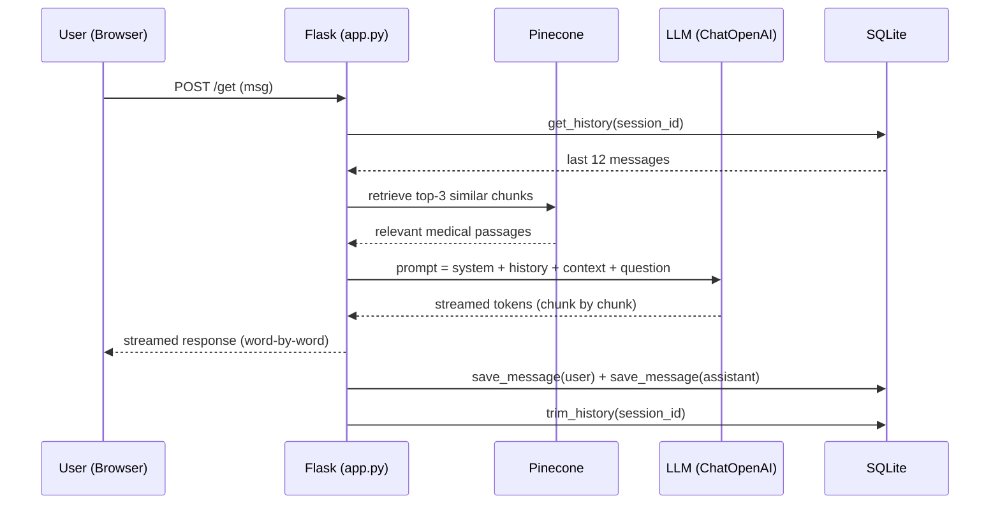

# Medora — Medical AI Assistant

Medora is a **Retrieval-Augmented Generation (RAG)** chatbot that answers medical questions using a 637-page medical encyclopedia (the *GALE Encyclopedia of Medicine*). It retrieves relevant passages from a vector database and generates concise, conversational answers with a state-of-the-art LLM.

Built with **Flask**, **LangChain**, and **Pinecone**, Medora features a modern dark-teal chat interface, streaming responses, and persistent per-user conversation history.

---

## ✨ Features

- **RAG-powered answers** — retrieves the most relevant medical passages before answering, grounding responses in real medical reference content.
- **Streaming responses** — answers appear word-by-word as the model generates them, for a natural chat feel.
- **Conversation memory** — the last 12 messages per user are stored in SQLite and injected into the prompt, so Medora remembers what you said earlier.
- **Concise output** — the model is instructed to respond in at most 100 tokens (~75 words), with short paragraphs and minimal bullets.
- **Modern UI** — a responsive dark-teal chat interface with typing indicators, timestamps, and inline Markdown rendering.
- **Multi-user ready** — each browser session is isolated via a unique session ID.

---

## 🏗 Architecture

### System Overview

```
┌─────────────────────────────────────────────────────────────────────────────┐
│                              USER'S BROWSER                                 │
│  ┌─────────────────────────────┐   ┌─────────────────────────────────────┐  │
│  │  chat.html (jQuery UI)      │   │  static/style.css (dark-teal theme) │  │
│  │  • message input            │   └─────────────────────────────────────┘  │
│  │  • streaming bubble render  │                                            │
│  │  • markdown formatting      │                                            │
│  └──────────────┬──────────────┘                                            │
└─────────────────┼───────────────────────────────────────────────────────────┘
                  │  HTTP POST /get  (msg + session cookie)
                  │  SSE-style streamed response (text/plain, chunked)
                  ▼
┌─────────────────────────────────────────────────────────────────────────────┐
│                          FLASK APP  (app.py)                                │
│                                                                             │
│  ┌─────────────────────────────┐         ┌───────────────────────────────┐  │
│  │  RAG Chain (LangChain)      │         │  Conversation Memory          │  │
│  │                             │         │  (SQLite — chat_history.db)   │  │
│  │  {context, history, input}  │         │  • get_history(session_id)    │  │
│  │        │                    │         │  • save_message(...)          │  │
│  │        ▼                    │         │  • trim_history(...)          │  │
│  │  ChatPromptTemplate         │         └───────────────────────────────┘  │
│  │        │                    │                                            │
│  │        ▼                    │                                            │
│  │  ChatOpenAI (streaming)     │                                            │
│  │        │                    │                                            │
│  │        ▼                    │                                            │
│  │  StrOutputParser            │                                            │
│  └─────────────┬───────────────┘                                            │
└────────────────┼────────────────────────────────────────────────────────────┘
                 │
        ┌────────┴─────────┐
        ▼                  ▼
┌──────────────────┐  ┌──────────────────────────────┐
│  PINECONE        │  │  EMBEDDINGS                  │
│  index: medora   │  │  all-MiniLM-L6-v2            │
│  • 384-dim       │  │  (sentence-transformers)     │
│  • cosine metric │  └──────────────────────────────┘
│  • k=3 retrieval │
└──────────────────┘
```

### Request Flow (step by step)



### Component Table

| Component     | Technology                   | Purpose                                   |
| ------------- | ---------------------------- | ----------------------------------------- |
| Web framework | Flask 3.1                    | Serves the chat UI and `/get` API         |
| Vector store  | Pinecone (index `medora`)    | Stores 384-dim embeddings of medical text |
| Embeddings    | `all-MiniLM-L6-v2`           | Converts text into vectors                |
| LLM           | `ChatOpenAI` (streaming)     | Generates the final answer                |
| Memory        | SQLite (`chat_history.db`)   | Persists the last 12 messages per session |
| Frontend      | HTML + CSS + jQuery          | Chat interface with live streaming        |

---

## 📁 Project Structure

```
Medora/
├── app.py                 # Flask app: RAG chain, streaming, memory
├── store_index.py         # One-time script: create Pinecone index & upload docs
├── requirements.txt       # Python dependencies
├── setup.py               # Package metadata
├── template.sh            # (optional) deployment template
├── Data/                  # Medical PDFs (e.g. Medical_book.pdf)
├── src/
│   ├── __init__.py
│   ├── helper.py          # PDF loading, chunking, embeddings
│   └── prompt.py          # System prompt for the LLM
├── static/
│   └── style.css          # Chat UI styling
└── templates/
    └── chat.html          # Chat interface
```

---

## 🚀 Installation

### Prerequisites

- **Python 3.9+**
- A **Pinecone** account and API key
- An **OpenAI-compatible** LLM API key and base URL

### 1. Clone the repository

```bash
git clone https://github.com/prosanto0das/Medora.git
cd Medora
```

### 2. Create a virtual environment

```bash
python3 -m venv venv
source venv/bin/activate        # Linux / macOS
# venv\Scripts\activate        # Windows
```

### 3. Install dependencies

```bash
pip install -r requirements.txt
```

### 4. Configure environment variables

The repository includes a `.env.example` template. Copy it and fill in your real values:

```bash
cp .env.example .env
```

Then open `.env` and replace the placeholders with your actual credentials:

```env
PINECONE_API_KEY=your-pinecone-api-key
COMPANY_API_KEY=your-llm-api-key
COMPANY_BASE_URL=https://your-llm-endpoint
SECRET_KEY=your-random-secret
```

| Variable          | Required | Description                                                        |
| ----------------- | -------- | ------------------------------------------------------------------ |
| `PINECONE_API_KEY` | ✅ Yes   | Your Pinecone API key (from [app.pinecone.io](https://app.pinecone.io)) |
| `COMPANY_API_KEY`  | ✅ Yes   | Your LLM provider's API key                                         |
| `COMPANY_BASE_URL` | ✅ Yes   | Your LLM provider's OpenAI-compatible endpoint URL                  |
| `SECRET_KEY`       | ❌ No    | Flask session secret; a dev fallback is used if missing             |

> ⚠️ **Never commit `.env`.** It is already listed in `.gitignore`.

### 5. Build the vector index (one time)

Place your medical PDFs in the `Data/` folder, then run:

```bash
python store_index.py
```

This creates the `medora` index in Pinecone (if missing) and uploads the documents as embeddings. It skips the upload if the index already has data.

### 6. Run the app

```bash
python app.py
```

Open [http://localhost:8080](http://localhost:8080) in your browser.

---

## 🧠 How It Works

1. The user types a question in the chat.
2. The question is embedded and used to retrieve the **top 3 most relevant** passages from Pinecone.
3. The retrieved context, the user's last 12 messages, and the system prompt are combined.
4. The LLM generates a concise answer (≤ 100 tokens), which **streams** back to the browser word-by-word.
5. The exchange is saved to SQLite for future context.

---

## 🔧 Configuration

| Setting          | Where                                     | Default              |
| ---------------- | ----------------------------------------- | -------------------- |
| Port             | `app.py` → `app.run(port=8080)`      | `8080`             |
| Host             | `app.py` → `app.run(host="0.0.0.0")` | `0.0.0.0`          |
| Retrieved chunks | `app.py` → `search_kwargs={"k": 3}`  | `3`                |
| History window   | `app.py` → `MAX_HISTORY_MESSAGES`    | `12`               |
| Chunk size       | `src/helper.py` → `chunk_size`       | `500`              |
| Chunk overlap    | `src/helper.py` → `chunk_overlap`    | `50`               |
| Embedding model  | `src/helper.py` → `model_name`       | `all-MiniLM-L6-v2` |

---

## 🗄 Data Storage

- **`chat_history.db`** — SQLite database created automatically on first run. Stores the last 12 messages per session. Old messages are trimmed automatically. This file is gitignored.
- **Pinecone index `medora`** — stores the vector embeddings of your medical documents.

---

## 🛠 Troubleshooting

| Problem                                  | Likely cause               | Fix                                           |
| ---------------------------------------- | -------------------------- | --------------------------------------------- |
| `Import "flask" could not be resolved` | Editor not using the venv  | Select the`venv` interpreter in your editor |
| App crashes on startup                   | Missing/invalid API keys   | Check`.env` values                          |
| Index is empty                           | `store_index.py` not run | Run`python store_index.py`                  |
| No streaming in chat                     | Browser/proxy buffering    | Use a modern browser; check network           |

---

## 📄 License

This project is licensed under the [MIT License](LICENSE).

---

## 👤 Author

**Prosanto Das** — [prosanto0das23@gmail.com](mailto:prosanto0das23@gmail.com)

---

## ⚠️ Disclaimer

Medora provides **general health information only** and is **not a substitute for professional medical advice, diagnosis, or treatment**. Always consult a qualified healthcare provider for medical concerns.
